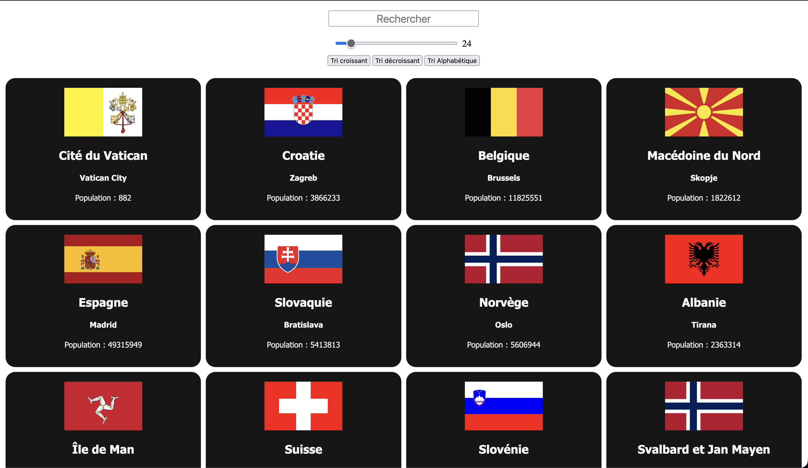

# 🌍 World-Explorer - API Data Processing Engine

**Projet d'étude** focalisé sur la consommation d'API REST asynchrones et le traitement avancé de jeux de données (filtrage, tri, formatage).
Une interface dynamique permettant d'explorer les nations du monde en temps réel via des requêtes HTTP optimisées.



## 🎯 Contexte & Objectifs Pédagogiques

Ce projet constitue une étape majeure de mon **parcours de formation en autodidacte**. Il marque la transition entre la manipulation de données statiques et l'exploitation de flux de données externes réels.

L'enjeu principal était de gérer le cycle de vie d'une requête asynchrone, de la récupération des données (Fetch) jusqu'à leur rendu conditionnel dans le DOM.

**Objectifs validés :**

- Maitrise de l'**Asynchronisme** : Migration d'une logique `Promise.all().then()` vers une syntaxe moderne `Async / Await`.
- Gestion des **Requêtes Concurrentes** : Récupération simultanée de données par régions pour optimiser le temps de chargement.
- Algorithmique de **Traitement de Données** : Implémentation de pipelines complexes combinant `.filter()`, `.sort()`, `.slice()` et `.map()`.
- Expérience Utilisateur (UX) : Recherche textuelle dynamique et filtres de quantité en temps réel.

## 🛠️ Stack Technique

- **Frontend :** HTML5, CSS3 (Flexbox & Responsive Design).
- **Scripting :** JavaScript ES6+ (Async/Await, Fetch API).
- **Source de données :** [Rest Countries API](https://restcountries.com/).

## ✨ Fonctionnalités Développées

### 1. Moteur de Recherche Prédictif

Intégration d'un filtre dynamique qui analyse la saisie utilisateur pour isoler les pays correspondants dans le jeu de données local, sans nécessiter de nouveaux appels API après le premier chargement.

### 2. Pipeline de Tri Avancé

Développement d'une logique de tri multidimensionnelle :

- **Démographique :** Tri croissant/décroissant par population.
- **Alphabétique :** Utilisation de `localeCompare` pour un tri textuel respectant les spécificités linguistiques (accents, caractères spéciaux).

### 3. Contrôle de l'Affichage (Pagination Dynamique)

Utilisation d'un composant `input range` pour permettre à l'utilisateur de limiter dynamiquement le nombre de résultats affichés, optimisant ainsi les performances de rendu du navigateur.

## 🏗️ Architecture du Code

Le projet démontre une séparation claire des responsabilités :

- **Data Fetching :** Une fonction asynchrone isolée pour la récupération des données.
- **State Management :** Utilisation de variables globales pour maintenir l'état du tri et des données reçues.
- **Render Engine :** Une fonction de rendu unique (`countriesDisplay`) qui traite la donnée brute à travers plusieurs filtres avant de générer le HTML.

## 🧠 Challenges Techniques Résolus

### Adaptation à l'obsolescence d'une API (Refactoring Critique)

Au cours du développement, l'endpoint initialement prévu pour récupérer l'intégralité des pays en une seule requête a été restreint par les administrateurs de l'API (pour des raisons de bande passante).

- **Le problème :** L'application ne recevait plus aucune donnée globale, rendant les méthodes de tri inutilisables.
- **Ma solution ("Max Artisanal") :** J'ai restructuré la logique de récupération en segmentant les appels par régions. En utilisant `Promise.all`, j'ai recréé un jeu de données complet tout en maintenant une vitesse de chargement optimale grâce à l'exécution parallèle des requêtes.

### Internationalisation des Données

Les données de l'API sont complexes et imbriquées. Le défi était de cibler précisément les noms en français pour le filtrage et l'affichage.

- _Solution :_ Implémentation de chemins d'accès sécurisés aux propriétés de l'objet (`country.translations.fra.common`) au sein du pipeline de traitement.

## ⚙️ Installation & Lancement

1. **Cloner le dépôt :**

```bash
git clone [https://github.com/EnzoRouet/World-Explorer]
```

2. **Lancer le projet :**
   Ouvrez le fichier index.html via Live Server.
